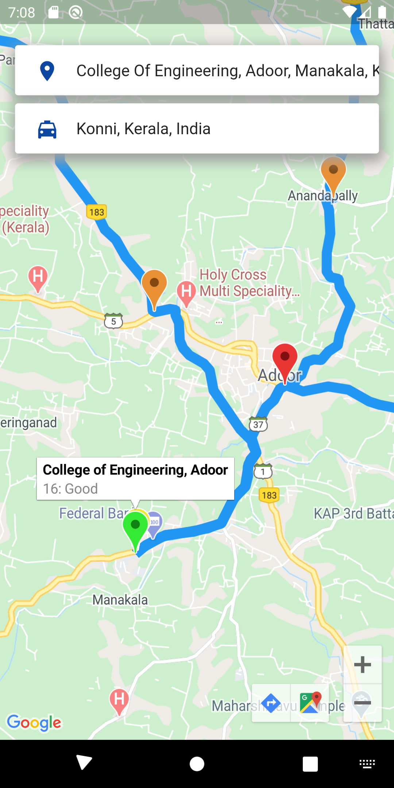

# OpenAir

Real-time Air Quality Monitoring and Navigation System based on IoT

## Screenshots

<div>
  
  <div>_</div>
  
</div>

<div>
   
  <div>_</div>
  
  <div>_</div>
  
</div>

<div>
  
  <div>_</div>
  
    <div>_</div>
  
</div>

<hr />

## Uses

- MQTT
- Websockets
- HTTP

```
                        _______________________
                        |      dashboard      |
                        | (web-socket client) |
                        |_____________________|
                                  |
                                  | web-socket protocol
                        _______________________
                        |         |           |
                        |  web-socket(server) |
                        |_____________________|
 __________________     |         |           |      __________________      ______________      _______________
 | mqtt publisher | --> |     mqtt broker     | <--> | mqtt subscriber | --> | API server | <--> | Android App |
 |________________|     |_____________________|      |_________________|     |____________|      |_____________|
                   mqtt                         mqtt                    http                http
                 protocol                     protocol                protocol            protocol
```

## Licence

Code released under the [GPL V3 License](LICENSE).
